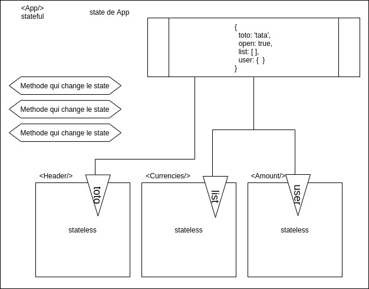

# State React




## Type de données

### Dans un composant Class

Quand je parle de state dans une class, je parle de...

Un tableau
Un booleen
[x] Un objet
Une fonction

```javascript
  state = {
    open: true,
    baseAmount: 1,
    devise: {
      name: "United States Dollar",
      rate: 1.09,
    },
  };
```

#### Modifer le state

Comment puis-je modifier mon state ?
A - N'importe quel composant le peux
B - Seul le composant qui a le state peut le modifier
C - Réponse B mais il y a un mais

Seul le composant possédant le state peut le consulter / modifier, mais il peut "faire passer" ces possibilités à ses enfants, via les props

```javascript
render() {
    const { open, devise, baseAmount } = this.state;

    const roundedConversion = Math.round(baseAmount * devise.rate * 100) / 100;

    return (
      <div className="app">
        <Header amount={baseAmount} />
        <Toggler open={open} toggle={this.toggle} />
        {open && (
          <Currencies list={data} onCurrencyClick={this.setSelectedCurrency} />
        )}

        <Amount value={roundedConversion} currency={devise.name} />
      </div>
    );
  }
```

Si je veux dans mon state écraser la propriété "toto" et lui donner comme nouvelle valeur "is perfect".
```changeState(toto, "tata")```
```setState(toto, "tata")```
```this.changeState({ toto:  'tata'})```
```this.setState({ toto:  'tata'})```
```setState({ toto:  'tata'})```


### Dans un composant fonction

